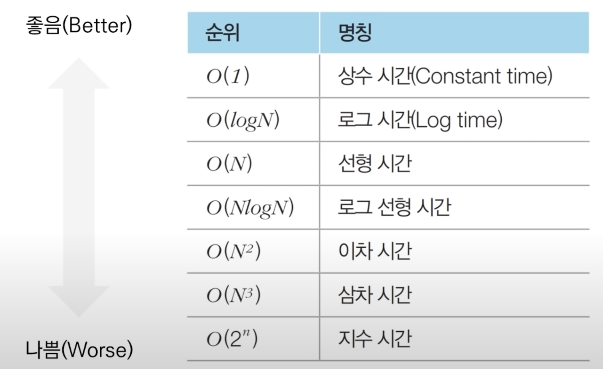

01 note

# 빅오 표기법


# 알고리즘 설계 Tip
- 일반적으로 CPU 기반의 개인 컴퓨터나 채점용 컴퓨터에서 연산 횟수가 5억을 넘어가는 경우:
    - C언어를 기준으로 통상 1~3초 가량의 시간이 소요
    - Python을 기준으로 통상 5~15초 가량의 시간이 소요
        - PyPy의 경우 때때로 C언어보다 빠르게 동작하기도 함

- 코딩 테스트 문제의 시간제한은 통상 1~5초 가량
    - 문제에 명시되어 있지 않은 경우 대략 5초라고 산정하고 문제를 푸는 것이 합리적

## 요구사항에 따라 적절한 알고리즘 설계하기
- 문제에서 가장 먼저 확인할 것은 시간제한(수행시간 요구사항)
- 시간제한이 1초인 문제를 만났을 때, 일반적인 기준은 다음과 같다.
    - N의 범위가 500인 경우, **시간복잡도가 O(N^3)**인 알고리즘 설계
    - N의 범위가 2,000인 경우, **시간 복잡도가 O(N^2)**인 알고리즘 설계
    - N의 범위가 100,000인 경우, **시간복잡도가 O(NlogN)**인 알고리즘 설계
    - N의 범위가 10,000,000인 경우, **시간복잡도가 O(N)**인 알고리즘 설계

## 알고리즘 문제 해결 과정
- 일반적인 알고리즘 문제 해결 과정
    1. 지문 읽기 및 컴퓨터적 사고
    2. 요구사항(복잡도) 분석
        - 문제 잘개 나누어 보기
    3. 문제 해결을 위한 아이디어 찾기
    4. 소스코드 설계 및 코딩
- 일반적으로 대부분의 문제 출제자들은 핵심 아이디어를 캐치한다면, 간결하게 소스코드를 작성할 수 있는 형태로 문제를 출제한다.
- 먼저 문제를 이해하고 어떤 식으로 코드를 적어 나갈지 생각한 후, 코드를 적자.

## 수행시간 측정 소스코드 예제
```py
import time
start_time = time.time() # 측정시작

# 프로그램 소스 코드

end_time = time.time() # 측정 종료
print("time:",end_time - start_time) # 수행시간 출력
```

