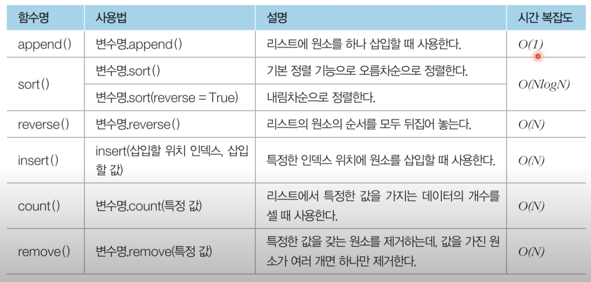

# 자료형
- 모든 프로그래밍은 결국 데이터를 다루는 행위
    - 자료형에 대한 이해는 프로그래밍의 길에 있어서의 첫걸음
- 파이썬의 자료형으로 다음이 있다.
    - 정수형
    - 실수형
    - 복소수형
    - 문자열
    - 리스트
    - 튜플
    - 사전

# 정수형
- Integer 정수를 다루는 자료형
- 양의 정수, 음의 정수, 0

# 실수형
- 소수점 아래 데이터를 포함하는 수 자료형
- 파이수에서는 변수에 소수점을 붙인 수를 대입하면 자동으로 실수형 변수로 처리된다.
- 소수부가 0이거나 정수부가 0일때 0을 생략할 수 있다.

## 지수표현 방식
- 파이썬에서는 e나 E를 이용한 지수표현 방식 사용 가능
    - e나 E 다음에 나오는 수를 10의 지수부를 의미합니다.
    - 1e9 -- 10^9
- 지수 표현 방식은 임의의 큰 수를 표현하기 위해 자주 사용된다.
- 최단 경로 알고리즘에서는 도달할 수 없는 노드에 대해 최단 거리를 무한INF로 설정하곤 한다.
- 이때 가능한 최댓값이 10억 미만이라면 무한의 값으로 1e9를 이용할 수 있다.
- 결과값은 실수형으로 나온다.

## 실수형 더 알아보기
- 지금 가장 널리 쓰이는 IEEE754 표준에서는 실수형을 저장하기 위해 4바이트, 혹은 8바이트의 고정된 크기의 메모리를 할당하므로, 컴퓨터 시스템은 실수 정보를 표현하는 정확도에 한계를 가진다.
- 예를 들어 10진수 체계에서는 0.3과 0.6을 더한 값이 0.9로 정확히 떨어진다.
    - 하지만 2진수에서는 0.9를 정확히 표현할 수 있는 방법은 없다.
    - 컴퓨터는 최대한 0.9와 가깝게 표현하지만 미세한 오차가 발생한다.
- 개발 과정에서는 실수값을 제대로 비교하지 못해서 원하는 결과를 엊지 못할 수 있다.
- 이럴때는 round() 함수를 이용할 수 있으며, 이렇나 방법이 권장된다.
- 예를 들어 123.456을 소수 셋째자리에서 반올림하려면 `round(123.456,2)` 라고 작성

## 수 자료형의 연산
- 수 자료형에 대하여 사칙연산과 나머지 연산자가 많이 사용된다.
- 단 나누기 연산자(/)를 주의해서 사용
    - 나눠진 결과는 실수형으로 반환한다.
- 다양한 로직을 설계할 때 나머지 연산자(%)를 이용해야 할 때가 많다.
- 몫을 얻기 위해 몫 연산자(//)
- 거듭 제곱 연산자 (**)

# 리스트 자료형
- 여러 개의 데이터를 연속적으로 담아 처리하기 위해 사용하는 자료형
    - 리스트 대신에 배열 혹은 테이블이라고 부르기도 함

## 리스트 초기화
- 대괄호[] 안에 원소를 넣어 초기화, 쉼표(,)로 원소 구분
- 비어 있는 리스트를 선언하고자 할 때는 list() 혹은 간단히 [] 를 이용할 수 있다.
- 리스트의 원소에 접근할때는 인덱스 index 값을 괄호에 넣는다.
    - 인덱스는 0에서부터 시작한다.

## 리스트의 인덱싱과 슬라이싱
- 인덱스 갑을 입력하여 리스트의 특정한 원소에 접근하는 것을 인덱싱(Indexing) 이라고한다.
    - 양의 정수를 넣으면 앞에서 카운트
    - 음의 정수를 넣으면 뒤에서 카운트한다.
- 인덱스에서 연속적인 위치를 갖는 원소를 가져와야할 때는 슬라이싱을 이용한다.
    - 대괄호 안에 콜론 (:)을 넣어서 시작 인덱스와 끝 인덱스를 설정할 수 있다.
    - 끝 인덱스는 실제 인덱스보다 1 더 크게 설정한다.

## 리스트 컴프리헨션
- 리스트를 초기화하는 방법 중 하나
    - 대괄호 안에 조건문과 반복문을 적용하여 리스트 초기화
- 특히 2차우너 리스트를 초기화할 때 효과적으로 사용할 수 있다.
- N * M 크기의 2차원 리스트를 한번에 초기화 해야할 때 유용
    - array = [[0]*m for _ in range(n)]

### 언더바 사용법
- 반복을 수행하되 반복을 위한 변수 값을 무시하고 싶을 때 언더바(_) 사용

## 리스트 관련 메소드

