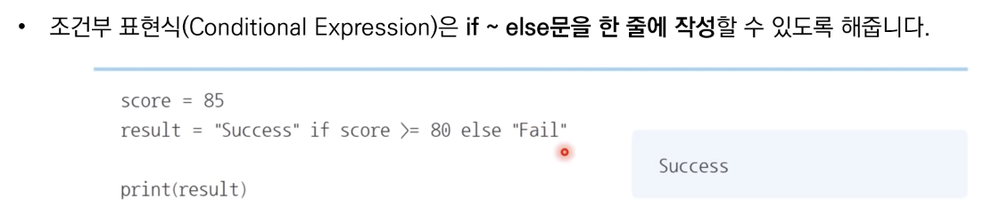
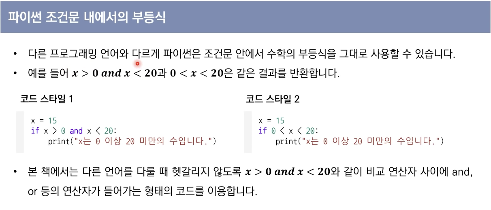

# 기본 입출력
- 모든 프로그램은 적절한 입출력 양식을 가지고 있다.

## 자주 사용되는 표준 입력방법
- input() 함수는 한 줄의 문자열을 입력 받는 함수
- map() 함수는 리스트의 모든 원소에 각각 특정한 함수를 적용할 때 사용
```py
# 공백을 기준으로 구분된 데이터를 입력받을 때
list(map(int, input().split()))

# 데이터가 많지 않을 때
a,b,c = map(int,input().split())
```

## 사용자로부터 입력을 최대한 빠르게 받아야 하는 경우
- `sys.stdin.readline()`
    - 단, 입력 후 엔터가 줄바꿈 기호로 입력되므로 rstrip() 메서드를 함께 사용한다.
```py
import sys
data = sys.stdin.readline().rstrip()
```

## 자주 사용되는 표준 출력 방법
- 파이썬에서 기본출력은 print() 함수를 이용
    - 각 변수를 콤마(,)를 이용하여 띄어쓰기로 구분하여 출력
- print()는 기본적으로 출력 이후 줄바꿈을 수행
    - 줄바꿈을 원치 않는 경우 end 속성을 이용

## f-string
- 파이썬 3.6부터 사용 가능
- 문자열 앞에 f를 붙여 사용
- 중괄호 안에 변수명을 기입하여 간단히 문자열과 정수를 함께 넣을 수 있다.
```py
answer = 7
print(f"정답은 {answer}입니다.")
```


