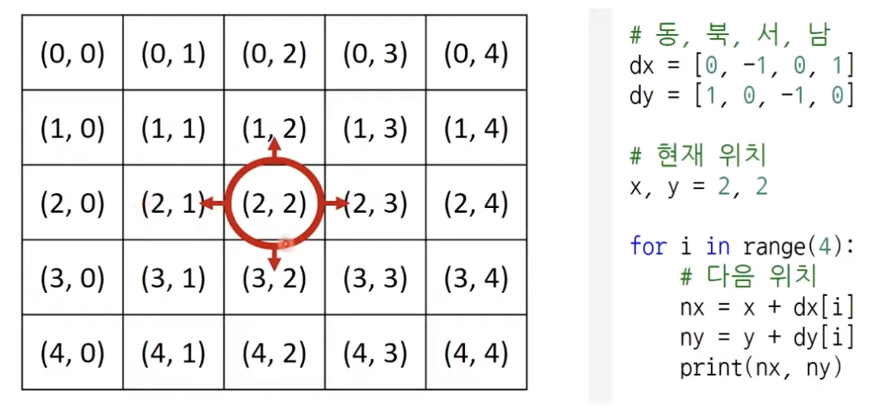

# 구현 Implementation

- 머릿속에 있는 것을 표현하는 것
- 알고리즘에서 구현 유형의 문제는?
  - 풀이를 떠올리는 것은 쉽지만, 소스코드로 옮기기 어려운 문제
- 예시
  - 알고리즘은 간단한데 코드가 지나칠만큼 길어지는 문제
  - 실수 연산을 다루고, 특정 소수점 자리까지 출력해야 하는 문제
  - 문자열을 특정한 기준에 따라서 끊어 처리해야 하는 문제
  - 적절한 라이브러리를 찾아서 사용해야 하는 문제
- 일반적으로 알고리즘 문제에서 2차원 공간은 행렬(Matrix)의 의미로 사용된다.
  - 시뮬레이션 및 완전 탐색 문제에서는 2차원 공간에서의 방향 벡터가 자주 활용된다.
